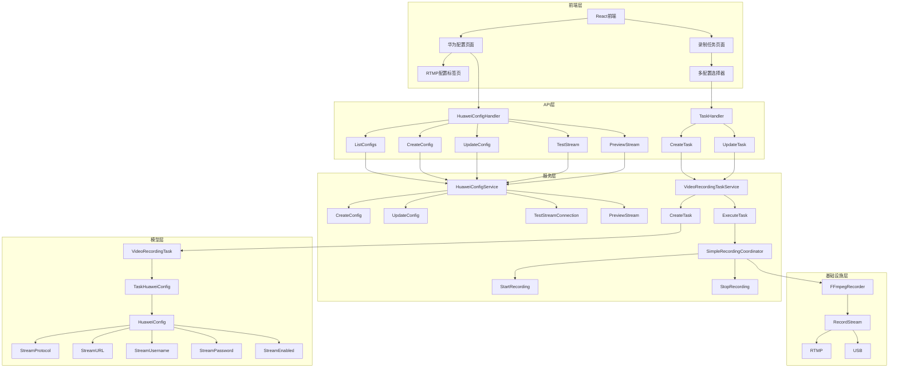

# RTMP流媒体视频信号录制功能开发指南

## 1. 需求分析与决策过程

### 1.1 需求概述
根据需求规范文档，我们需要为视频会议录制管理系统添加RTMP协议等流媒体视频信号录制功能，主要包括以下核心需求：

1. **华为配置RTMP配置**：在华为配置中添加RTMP配置相关标签，参考USB设备标签，选择协议类型可以进行测试和预览
2. **录制任务多选支持**：创建录制任务时选择华为配置可以多选，同类型的不可多选（仅可选择一路USB和一路RTMP）
3. **多路录制支持**：如果同时选择了RTMP和USB设备的两个华为配置，则分别进行两路录制
4. **流媒体录制文件名命名**：流媒体录制生成的文件名称在USB录制的命名方式后面添加stream后缀

### 1.2 架构决策

#### 1.2.1 现有架构分析
- **系统架构**：采用六边形架构设计，分为API层、服务层、领域模型层和基础设施层
- **核心模块**：华为配置管理、视频录制任务管理、FFmpeg录制、RTSP流媒体处理
- **技术栈**：Go语言后端、React前端、FFmpeg视频处理

#### 1.2.2 决策点与解决方案

| 决策点 | 问题描述 | 解决方案 | 依据 | 影响范围 |
|--------|----------|----------|------|----------|
| 配置管理 | 如何在现有华为配置中添加RTMP相关配置 | 在`HuaweiConfig`模型中添加流媒体相关字段，在前端添加"RTMP配置"标签页 | 参考现有的USB设备配置方式，保持架构一致性 | 模型层、API层、前端页面 |
| 任务管理 | 如何支持一个任务关联多个华为配置 | 创建`TaskHuaweiConfig`关联表，支持一对多关系 | 符合关系型数据库设计原则，保持数据结构清晰 | 模型层、服务层、API层 |
| 录制实现 | 如何实现多路并行录制 | 扩展`SimpleRecordingCoordinator`，支持多配置并行录制 | 利用Go语言的并发特性，保持与现有录制逻辑的一致性 | 服务层、基础设施层 |
| 文件名命名 | 如何实现流媒体录制文件名的特殊命名 | 在录制协调器中根据配置类型添加文件名后缀 | 保持与现有命名逻辑的一致性，确保文件名清晰易辨 | 服务层、基础设施层 |

## 2. 技术架构设计

### 2.1 系统架构概览

### 2.2 核心模块设计

#### 2.2.1 华为配置模块
- **模型扩展**：在`HuaweiConfig`中添加流媒体相关字段
- **API扩展**：添加流媒体测试和预览接口
- **前端扩展**：添加"RTMP配置"标签页

#### 2.2.2 录制任务模块
- **模型扩展**：创建`TaskHuaweiConfig`关联表
- **API扩展**：修改任务创建和更新接口，支持多配置
- **前端扩展**：修改配置选择器，支持多选和类型验证

#### 2.2.3 录制协调模块
- **功能扩展**：支持多配置并行录制
- **文件名处理**：根据配置类型添加文件名后缀
- **错误处理**：确保多路录制的错误隔离

## 3. 详细实现计划

### 3.1 后端实现

#### 3.1.1 模型层修改

1. **扩展`HuaweiConfig`模型**
   - 文件：`internal/models/huawei_config.go`
   - 添加字段：`StreamProtocol`、`StreamURL`、`StreamUsername`、`StreamPassword`、`StreamEnabled`
   - 更新验证方法：确保流媒体配置的有效性

2. **创建`TaskHuaweiConfig`关联表**
   - 文件：`internal/models/task_huawei_config.go`
   - 字段：`TaskID`、`HuaweiConfigID`、`ConfigType`（标识USB或流媒体）
   - 索引：添加联合唯一索引，确保同类型配置不重复

3. **修改`VideoRecordingTask`模型**
   - 文件：`internal/models/video_recording_task.go`
   - 移除`HuaweiConfigID`字段
   - 添加与`TaskHuaweiConfig`的关联

#### 3.1.2 服务层修改

1. **扩展`HuaweiConfigService`**
   - 文件：`internal/services/huawei_config_service.go`
   - 添加`TestStreamConnection`方法：测试流媒体连接
   - 添加`PreviewStream`方法：获取流媒体预览

2. **修改`VideoRecordingTaskService`**
   - 文件：`internal/services/video_recording_task_service.go`
   - 修改`CreateTask`方法：支持多配置
   - 修改`ExecuteTask`方法：处理多配置录制

3. **扩展`SimpleRecordingCoordinator`**
   - 文件：`internal/recorder/coordinator.go`
   - 添加`StartMultiRecording`方法：启动多路录制
   - 添加`StopMultiRecording`方法：停止多路录制
   - 修改文件名生成逻辑：添加stream后缀

#### 3.1.3 API层修改

1. **扩展`HuaweiConfigHandler`**
   - 文件：`internal/handlers/huawei_config_handler.go`
   - 添加`TestStream`接口：测试流媒体连接
   - 添加`PreviewStream`接口：获取流媒体预览

2. **修改`TaskHandler`**
   - 文件：`internal/handlers/video_recording_task_handler.go`
   - 修改`CreateTask`接口：支持多配置
   - 修改`UpdateTask`接口：支持多配置

### 3.2 前端实现

#### 3.2.1 类型定义修改

1. **扩展`HuaweiConfig`类型**
   - 文件：`frontend/src/types/huawei-config.ts`
   - 添加流媒体相关字段

2. **修改`CreateTaskRequest`类型**
   - 文件：`frontend/src/types/task.ts`
   - 将`huawei_config_id`改为`huawei_config_ids`数组

#### 3.2.2 华为配置页面修改

1. **添加"RTMP配置"标签页**
   - 文件：`frontend/src/pages/system/huawei-configs/index.tsx`
   - 添加协议类型选择、流媒体URL输入、用户名/密码输入、测试和预览按钮

2. **添加流媒体测试和预览功能**
   - 文件：`frontend/src/api/huawei-config.ts`
   - 添加`testStream`和`previewStream`方法

#### 3.2.3 录制任务页面修改

1. **修改配置选择器**
   - 文件：`frontend/src/pages/tasks/index.tsx`
   - 将单选改为多选
   - 添加类型验证逻辑

2. **更新表单处理**
   - 修改`handleSubmit`方法：处理多配置数据
   - 更新表单验证规则

### 3.3 测试实现

#### 3.3.1 单元测试

1. **模型层测试**
   - 测试`HuaweiConfig`模型的流媒体字段验证
   - 测试`TaskHuaweiConfig`关联表的约束

2. **服务层测试**
   - 测试`HuaweiConfigService`的流媒体测试功能
   - 测试`VideoRecordingTaskService`的多配置支持
   - 测试`SimpleRecordingCoordinator`的多路录制功能

#### 3.3.2 集成测试

1. **API测试**
   - 测试华为配置的创建和更新（包含流媒体配置）
   - 测试录制任务的创建（包含多配置）

2. **端到端测试**
   - 测试完整的RTMP配置流程
   - 测试多路录制的完整流程

## 4. 部署与集成方案

### 4.1 数据库迁移

1. **创建迁移文件**
   - 添加`huawei_configs`表的流媒体字段
   - 创建`task_huawei_configs`关联表
   - 修改`video_recording_tasks`表，移除`huawei_config_id`字段

2. **迁移执行**
   - 使用GORM自动迁移或手动执行SQL脚本
   - 确保数据一致性和向后兼容

### 4.2 依赖管理

1. **后端依赖**
   - 确保FFmpeg支持RTMP协议
   - 检查Go依赖的版本兼容性

2. **前端依赖**
   - 确保React和相关库的版本兼容性
   - 检查视频预览组件的依赖

### 4.3 集成测试

1. **环境准备**
   - 配置测试用的RTMP流源
   - 准备测试用的USB设备

2. **测试场景**
   - 单RTMP配置录制
   - 单USB配置录制
   - RTMP+USB双配置录制
   - 多配置选择验证

## 5. 测试策略

### 5.1 功能测试

| 测试项 | 测试内容 | 预期结果 | 测试方法 |
|--------|----------|----------|----------|
| RTMP配置 | 验证华为配置中RTMP配置标签页的功能 | 标签页显示正确，配置项可编辑，数据可保存 | 前端手动测试 |
| 流媒体测试 | 验证RTMP连接测试功能 | 测试按钮能正确验证连接状态 | 前端手动测试 |
| 流媒体预览 | 验证RTMP流预览功能 | 预览按钮能正确显示流媒体画面 | 前端手动测试 |
| 多配置选择 | 验证录制任务创建时的多配置选择 | 支持选择多个配置，同类型配置无法重复选择 | 前端手动测试 |
| 多路录制 | 验证同时录制RTMP和USB流 | 系统能并行录制多路流，生成多个文件 | 端到端测试 |
| 文件名命名 | 验证流媒体录制文件的命名 | 流媒体录制文件名称添加stream后缀 | 文件系统检查 |

### 5.2 性能测试

| 测试项 | 测试内容 | 预期结果 | 测试方法 |
|--------|----------|----------|----------|
| 并发录制 | 测试多路录制的CPU和内存使用 | CPU使用率≤30%，内存使用率≤40% | 性能监控工具 |
| 录制延迟 | 测试录制启动和停止的响应时间 | 启动延迟≤3秒，停止延迟≤2秒 | 时间测量 |
| 系统稳定性 | 测试长时间多路录制的稳定性 | 系统运行24小时无异常 | 长时间运行测试 |

### 5.3 兼容性测试

| 测试项 | 测试内容 | 预期结果 | 测试方法 |
|--------|----------|----------|----------|
| 协议兼容性 | 测试不同流媒体协议的支持 | 支持RTMP、RTSP等主流协议 | 协议测试 |
| 设备兼容性 | 测试不同USB设备的兼容性 | 支持主流摄像头和音频设备 | 设备测试 |
| 浏览器兼容性 | 测试前端在不同浏览器的表现 | 支持Chrome、Firefox、Edge等主流浏览器 | 浏览器测试 |

## 6. 风险与缓解措施

### 6.1 技术风险

| 风险 | 影响程度 | 缓解措施 |
|------|----------|----------|
| 不同流媒体协议的实现复杂度 | 中等 | 采用模块化设计，为每种协议创建独立的录制实现类 |
| 多路录制的资源消耗 | 中等 | 优化录制代码，合理分配系统资源，监控系统负载 |
| 网络波动导致的录制中断 | 中等 | 实现自动重连机制，添加网络状态监控 |
| FFmpeg版本兼容性 | 低 | 锁定依赖库版本，进行充分的测试 |

### 6.2 业务风险

| 风险 | 影响程度 | 缓解措施 |
|------|----------|----------|
| 配置错误导致的录制失败 | 中等 | 添加配置验证和测试功能，提供详细的错误提示 |
| 存储空间不足 | 低 | 实现存储监控和告警机制，设置合理的文件保留策略 |
| 用户操作错误 | 低 | 优化前端界面，添加操作验证和提示 |

## 7. 实施计划

### 7.1 开发阶段

| 阶段 | 任务 | 负责人 | 时间估计 |
|------|------|--------|----------|
| 准备阶段 | 需求分析与架构设计 | 架构师 | 1天 |
| 后端开发 | 模型层修改 | 后端开发 | 1天 |
| 后端开发 | 服务层修改 | 后端开发 | 2天 |
| 后端开发 | API层修改 | 后端开发 | 1天 |
| 前端开发 | 华为配置页面修改 | 前端开发 | 2天 |
| 前端开发 | 录制任务页面修改 | 前端开发 | 1天 |
| 测试阶段 | 单元测试 | 测试工程师 | 1天 |
| 测试阶段 | 集成测试 | 测试工程师 | 1天 |
| 测试阶段 | 端到端测试 | 测试工程师 | 1天 |
| 部署阶段 | 数据库迁移 | 运维工程师 | 0.5天 |
| 部署阶段 | 系统部署 | 运维工程师 | 0.5天 |

### 7.2 里程碑

1. **模型层修改完成**：完成数据库模型的扩展和修改
2. **后端服务完成**：完成所有后端服务的实现和测试
3. **前端页面完成**：完成所有前端页面的修改和测试
4. **集成测试完成**：完成所有集成测试和端到端测试
5. **系统部署完成**：完成系统部署和验证

## 8. 结论

本开发指南详细说明了RTMP流媒体视频信号录制功能的实现方案，包括需求分析、架构设计、详细实现计划、测试策略和部署方案。方案遵循系统现有的架构设计原则，保持了代码的一致性和可维护性，同时满足了所有功能需求。

通过本方案的实施，系统将能够支持RTMP协议等流媒体视频信号的录制，实现多路并行录制，并提供清晰的文件命名方式，为用户提供更全面、更灵活的视频录制功能。